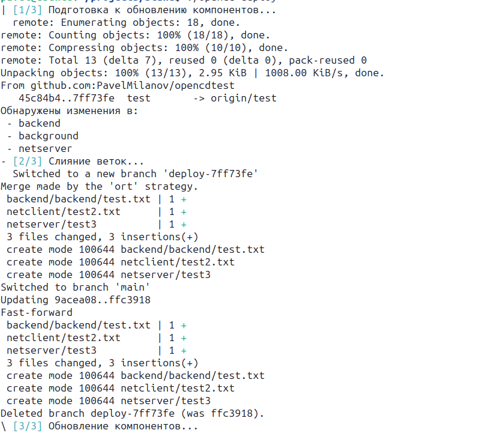

# **opencd** - cli-утилита для CD (continuous delivery) кода из вашего удаленного репозитория

___

## требования и зависимости

- ОС на базе дистрибутивов Linux (Debian, Ubuntu);
- установленные git, docker;
- наличие файла docker-compose.* в вашем проекте;
- доступ к удаленному репозиторию. (если репозиторий приватный - предварительно установить ssh-ключи для авторизации в репозитории).

## для чего нужен

- осуществляет непрерывную достаку кода из вашего удаленного репозитория с помощью файла конфигурации [opencd.yaml](opencd.yaml.template);
- собирает и перезапускает docker-контейнеры;

## как работает

- анализирует изменения удаленного и локального репозитория с помощью git;
- анализирует файл конфигурации docker-compose;
- автоматизирует сборку и обновление ваших компонентов docker-compose на основе изменений git.

## установка

- выполнить последовательно следующие команды:

```bash
wget https://github.com/PavelMilanov/opencd/releases/download/v0.1.1/install.sh
sudo sh ./install.sh
```

- проверка установленной версии opencd:

```bash
opencd version
```

- добавить в корень проекта файл [opencd.yaml](opencd.yaml.template)

## использование

- обновить проект:

```bash
opencd deploy
```


